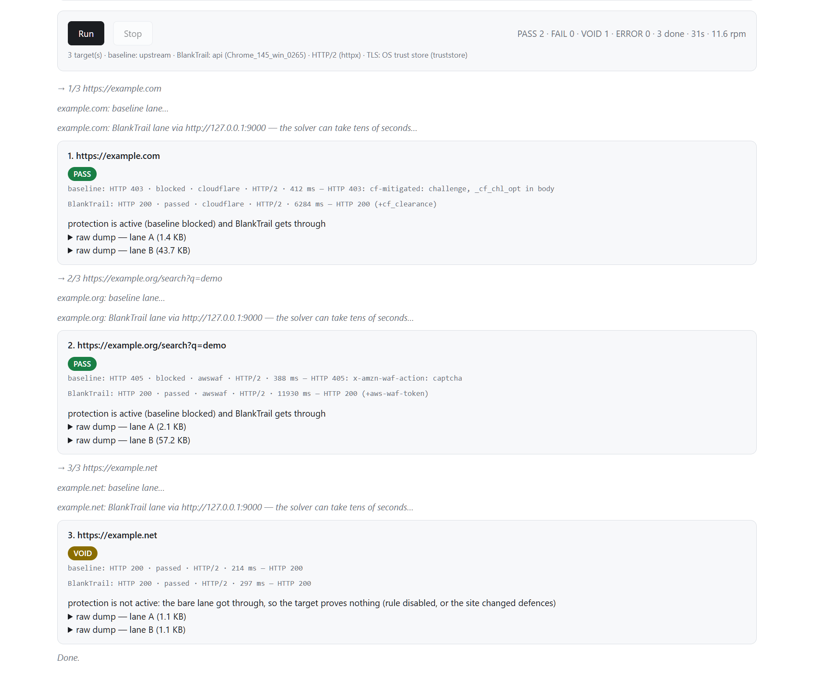

# BlankTrail Proxy — challenge pass-through demo

A client-side **demo** that answers one question, reproducibly: a bare Python
**client** does not get through a Cloudflare- or AWS-WAF-protected site, and
[BlankTrail Proxy](https://blanktrail.com) does.

**Русская версия: [README.ru.md](README.ru.md)**

> ⚠️ **A running BlankTrail Proxy instance is required — this repository
> does not include, install, or run it.** Point the demo at a port you
> already opened in BlankTrail, or at its REST API to have the demo open and
> close one for you; either way, BlankTrail itself has to already be running
> somewhere.


---

## 📚 Features

- Runs a **baseline lane** and a **BlankTrail lane** against the same target
  list, and turns each pair of outcomes into one of four verdicts — PASS,
  FAIL, VOID, or ERROR.
- Baseline lane has three modes: through an upstream proxy, direct, or
  switched off.
- Reaches BlankTrail Proxy either through preset ports you already opened,
  or through its REST API, which opens and closes a port for the run.
- TLS verification on the BlankTrail lane is on by default, backed by a
  choice of three trust sources: the OS trust store, a CA fetched from the
  API, or a local CA file.
- Streams results live: a verdict badge and an expandable raw dump per lane,
  for every target, plus a running counter.

---

## 📋 Requirements

- Python 3.10 or newer.
- A running BlankTrail Proxy instance — either one or more ports already
  open in it, or its REST API reachable. This demo does not include
  BlankTrail itself.
- Your own targets — the demo ships with none and suggests none.

---

## 🚀 Quick start

**1. Install and run.**

| Route | Get it |
|---|---|
| Windows, no install | Download [`blanktrail-demo.exe`](https://github.com/BlankTrail/blanktrail-demo/releases/latest/download/blanktrail-demo.exe) and double-click it |
| Any platform, from source | `run.bat` (Windows) / `./run.sh` (Linux, macOS) / `python -m blanktrail_demo` (venv already set up) |

The exe packages the demo only — **a running BlankTrail Proxy instance is
still required either way**, same as the from-source route (see the callout
above). It opens a console window with the same address banner as below and
a browser tab; Windows may flag an unsigned exe, so choose **More info ->
Run anyway** at the SmartScreen prompt.

`run.bat` and `run.sh` create a local `.venv` on first run, install
`requirements.txt` into it, and start the demo. To do the same by hand:

```bash
python -m venv .venv
source .venv/bin/activate      # Windows: .venv\Scripts\activate
pip install -r requirements.txt
python -m blanktrail_demo
```

**2. Open the page.** The process prints an address and opens it in your
browser automatically:

```
BlankTrail demo -> http://127.0.0.1:8790/
```

See "Command line" below to change the port, the bind address, or turn off
the automatic browser launch.

**3. Configure a run.** Paste your targets into the **Targets** box, one URL
per line (`#` starts a comment; blank lines are ignored; up to 200 targets
per run), set the baseline lane and the BlankTrail lane — see "The two
lanes" and "Reaching BlankTrail" below — and click **Run**.

**4. Read the results.** Results stream in live: a verdict badge and an
expandable raw dump per lane, for every target — see "Verdicts" below.

---

## ⚖️ The two lanes

Every target is fetched twice: once by the **baseline lane** (a bare
`requests`/`httpx` client, no BlankTrail involved) and once by the
**BlankTrail lane** (the same client, through a BlankTrail port). The
baseline lane has three modes:

| Mode | What happens | Use it when |
|---|---|---|
| `upstream` (default) | The baseline request goes through an upstream proxy you supply | You want the comparison below to actually mean something (recommended) |
| `direct` | The baseline request leaves straight from this machine | A quick smoke test — see the warning below |
| `off` | The baseline lane does not run at all | You already know the target challenges bare clients and only want to check BlankTrail |

**Point the baseline lane's upstream at the same upstream proxy you gave the
BlankTrail port.** The two lanes are only comparable if they leave from the
same egress IP — then the only thing left to differ between them is the
TLS/HTTP2 fingerprint and the solver, which is the thing being measured. Run
the baseline lane `direct` and that stops being true: it leaves from a
different IP than the BlankTrail lane, so a PASS or a FAIL might really be
about that IP's reputation, not about anything BlankTrail did. The demo does
not hide this — `direct` and `off` both print a warning in the run header
for exactly this reason.

---

## 🔌 Reaching BlankTrail: preset proxy vs REST API

The BlankTrail lane needs a proxy URL for each target. The demo gets one in
either of two ways.

**Preset proxy** — one or more ports you already opened in BlankTrail
yourself, pasted as-is:

```
http://127.0.0.1:9000
http://127.0.0.1:9001
```

One line is a fixed port used for every target; several lines are a pool,
round-robined by target index. The demo only reads from these ports — it
never opens or closes them; they are yours to manage.

**REST API** — the demo opens one port for the whole run and closes it when
done:

```
API base URL: http://127.0.0.1:8891
Port: 9000        Protocol: HTTP CONNECT
```

In order:

1. `GET /api/v1/health` — checked up front, before the first target
   request, so a misconfigured API base URL or key fails once, clearly,
   instead of once per target.
2. `POST /api/v1/ports/open` — opens the port with the settings from the
   form (protocol, profile mode, browser/OS filters, upstream proxy, and
   toggles including **Challenge Breaker (`js_solver`)**, HTTP/2 spoofing,
   auto-rotate, and keep-sessions).
3. Every target is then fetched through `http://127.0.0.1:<port>` (or
   `socks5h://127.0.0.1:<port>` for a SOCKS5 port).
4. `POST /api/v1/ports/close` — closes the port at the end of the run,
   unless you uncheck **Close the port when done**. Closing is best-effort:
   if it fails, the verdicts already produced are unaffected, and the port
   still closes itself on idle timeout.

The API key you enter is sent only to the API base URL you configured, in an
`X-API-Key` header, and is kept in memory for the run — never written to
disk, never included in a log line or event.

---

## 🖥 Command line

```
python -m blanktrail_demo [--port N] [--host ADDR] [--no-open]
```

| Flag | Default | Meaning |
|---|---|---|
| `--port N` | `8790` | web UI port — the demo's own UI, not a BlankTrail proxy port |
| `--host ADDR` | `127.0.0.1` | web UI bind address |
| `--no-open` | off | do not open a browser window automatically |

The web UI binds to `127.0.0.1` only — reachable from this machine, not from
the network — and it has no login of its own. Change `--host` only if you
understand what you are exposing.

---

## 🏗 Building from source

Windows users can build their own single-file `blanktrail-demo.exe` instead
of downloading the release:

```powershell
.\build-windows.ps1
```

It installs [PyInstaller](https://pyinstaller.org) into `.venv` (creating
one first if `run.bat` has not already), freezes the demo and its runtime
dependencies into one file, and prints the path it wrote —
`dist\blanktrail-demo.exe`. PyInstaller is a build-time tool only: it lives
in `requirements-build.txt`, never in `requirements.txt`, which stays the
list of what the demo needs at runtime.

---

## 🔐 TLS and the MITM certificate

Certificate verification on the BlankTrail lane is **on by default**, and it
is part of the measurement, not a formality: a successful TLS handshake
proves the substituted certificate's chain is well-formed and its SAN
matches the host you asked for. A PASS earned with verification off would
not really prove that. The baseline lane is never behind BlankTrail's proxy,
so none of this applies to it — it always verifies normally, like any
ordinary HTTPS client.

**The trap this exists to solve.** Python's own `ssl` module reads your
operating system's trust store just fine — but `requests` and `httpx` do not
use it on their own. By default, both pass `cafile=certifi.where()` when
they build their SSL context, which points at the CA bundle `certifi` ships
inside itself, not at your OS's roots. This was measured, not assumed: on
Windows 10 / CPython 3.13.5, `ssl.create_default_context()` resolves 228
system roots — the installed BlankTrail CA among them — while `requests`'
own bundle points at a `certifi`-packaged file instead, never at the OS
store. So installing the BlankTrail CA system-wide changes nothing for a
plain `requests.get()` or `httpx.get()` call: the OS-trusted root is sitting
right there, and neither client looks at it. The fix is to build the SSL
context yourself and hand it to the client explicitly, which is what this
demo does for the BlankTrail lane.

Three trust sources, picked with a radio button in the **Transport and TLS**
section:

| Source | How the context is built | Use it when |
|---|---|---|
| **OS trust store** (default) | `truststore` if it's installed (reads the OS store through its native API), else Python's own `ssl.create_default_context()` | The BlankTrail CA is already installed system-wide — the normal case |
| **Fetch CA from the API** | `GET /api/v1/ca`, combined with `certifi`'s own bundle into one file for the run | Installing the CA is inconvenient or impossible: a container, CI, a laptop without admin rights, a remote instance |
| **CA file** | A local `ca.crt` you point at, combined with `certifi`'s bundle the same way | You already have the CA as a file and would rather not install it |

The last two build a *combined* bundle — `certifi`'s roots plus the
BlankTrail CA — never a replacement. A target excluded from the MITM port
presents its own real certificate, and a bundle holding only the BlankTrail
root would fail to verify that target. If the chosen source can't be
honoured (file missing, API fetch fails), the run refuses to start rather
than silently falling back to no verification — a green verdict must never
be one that skipped checking anything. A separate **Disable TLS
verification** checkbox exists for diagnostics; it is off by default, and
turning it on means the verdicts it produces no longer prove the certificate
chain is sound.

**A note on macOS.** On Windows and Linux, Python's stdlib context already
reads the OS-provided trust store, so the OS trust store option works even
without `truststore` installed. On macOS it does not: CPython does not read
the Keychain on its own, so a CA installed there is invisible to a bare
`ssl.create_default_context()`. `truststore` (listed in `requirements.txt`,
installed automatically by the launcher scripts) closes that gap by going
through macOS's native Security framework instead. If you ever run this
demo on macOS without `truststore` present, switch the trust source to
"Fetch from API" or "CA file" — the OS store option will silently fall back
to a context that cannot see a Keychain-only CA.

---

## 📊 Verdicts

Each target produces one line per lane, and one verdict for the pair.



| Verdict | What it means |
|---|---|
| `PASS` | The baseline lane was blocked (or switched off) and the BlankTrail lane got through. |
| `FAIL` | The baseline lane was blocked (or switched off) and the BlankTrail lane did **not** get through either. One data point that BlankTrail did not get through on this run — not a statement that this is a defect in BlankTrail. |
| `VOID` | The run proved nothing: either the baseline lane got through too — only possible while it is running, and meaning the target was not actively defending itself at the time — or a lane that did run returned a response the classifier could not read as blocked or clean; open its raw dump and read it yourself. VOID is not a defect. |
| `ERROR` | A request itself failed — network or TLS — before any verdict about blocking could be reached. |

When the baseline lane is switched off, a PASS only means BlankTrail got
through; on its own it does not prove the target challenges bare clients at
all (see "The two lanes" above).

---

## ❤️ About BlankTrail

This demo is free and open so its comparison can be checked by anyone,
rather than taken on faith — every verdict comes from a run you can
reproduce yourself. [BlankTrail Proxy](https://blanktrail.com) is the
product being measured; this repository exists to show it working, not to
describe how it works inside.

---

## 📄 Licence

MIT. See [LICENSE](LICENSE).

The software is provided "as is", without warranty of any kind. You are
responsible for how you use it, including for observing the terms of
service of the sites you point it at and the law where you are.
